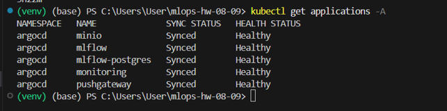
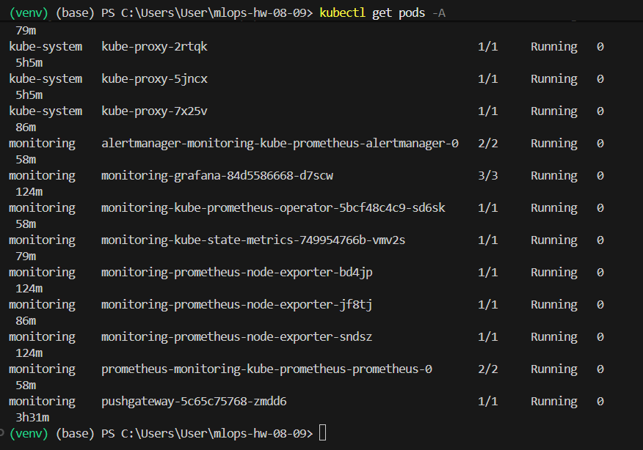
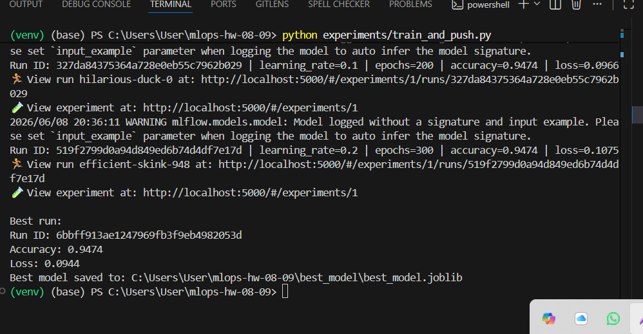
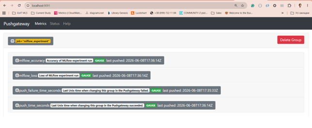
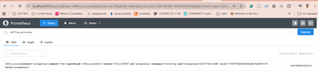
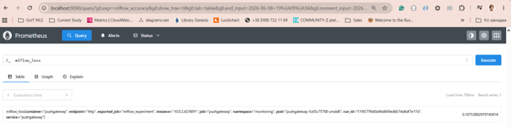
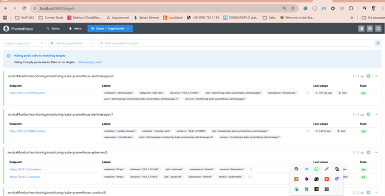
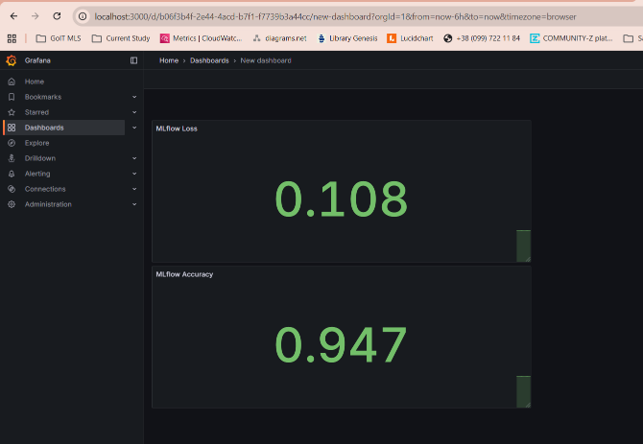

# MLOps Homework 08–09

## Project Overview

This project demonstrates a complete end-to-end MLOps workflow deployed on Kubernetes using GitOps principles with ArgoCD.

The solution integrates machine learning experiment tracking, artifact management, custom metrics collection, monitoring, and visualization into a unified cloud-native platform running on Amazon EKS.

The platform includes:

* MLflow for experiment tracking
* PostgreSQL as MLflow backend store
* MinIO as artifact storage
* Pushgateway for custom metric ingestion
* Prometheus for metrics collection
* Grafana for metrics visualization
* ArgoCD for GitOps deployment and application management
* Amazon EKS as Kubernetes platform

---

## Architecture

```text
ML Training Script
        │
        ▼
      MLflow
        │
        ├── PostgreSQL (metadata)
        │
        └── MinIO (artifacts)
        │
        ▼
   Pushgateway
        │
        ▼
    Prometheus
        │
        ▼
     Grafana
```

---

## Monitoring Flow

The monitoring pipeline collects machine learning metrics and visualizes them in Grafana.

```text
MLflow Experiment
        │
        │ logs metrics
        ▼
train_and_push.py
        │
        │ pushes custom metrics
        ▼
Pushgateway
        │
        │ scraped by
        ▼
Prometheus
        │
        │ queried by
        ▼
Grafana Dashboard
```

### Exported Metrics

| Metric          | Description                   |
| --------------- | ----------------------------- |
| mlflow_accuracy | Classification model accuracy |
| mlflow_loss     | Classification model loss     |

### Example Metrics

```text
mlflow_accuracy 0.9474
mlflow_loss 0.1075
```

---

## Technologies Used

| Component   | Purpose                 |
| ----------- | ----------------------- |
| Amazon EKS  | Kubernetes platform     |
| ArgoCD      | GitOps deployment       |
| MLflow      | Experiment tracking     |
| PostgreSQL  | MLflow backend database |
| MinIO       | Artifact storage        |
| Pushgateway | Custom metrics endpoint |
| Prometheus  | Metrics collection      |
| Grafana     | Monitoring dashboards   |
| Python      | Model training          |

---

## Project Structure

```text
.
├── argocd/
│   └── applications/
│       ├── minio.yaml
│       ├── mlflow.yaml
│       ├── postgres.yaml
│       └── pushgateway.yaml
│
├── experiments/
│   ├── train_and_push.py
│   ├── requirements.txt
│   └── .env
│
├── best_model/
│   ├── best_model.joblib
│   └── metadata.txt
│
├── screenshots/
│   ├── argocd-applications.png
│   ├── grafana-dashboard.png
│   ├── k8s-pods.png
│   ├── prometheus-accuracy.png
│   ├── prometheus-loss.png
│   ├── prometheus-targets.png
│   ├── pushgateway-metrics.png
│   └── train-script-result.png
│
├── monitoring.yaml
├── prometheus-manual.yaml
├── pushgateway-servicemonitor.yaml
└── README.md
```

---

## Deployment

### Deploy ArgoCD Applications

```bash
kubectl apply -f argocd/applications/postgres.yaml
kubectl apply -f argocd/applications/minio.yaml
kubectl apply -f argocd/applications/mlflow.yaml
kubectl apply -f argocd/applications/pushgateway.yaml
kubectl apply -f monitoring.yaml
```

---

## Running the Experiment

### Activate Virtual Environment

Windows:

```powershell
venv\Scripts\activate
```

Linux / macOS:

```bash
source venv/bin/activate
```

### Install Dependencies

```bash
pip install -r experiments/requirements.txt
```

### Run Training Script

```bash
python experiments/train_and_push.py
```

The script performs the following actions:

* Loads the Iris dataset
* Trains multiple Logistic Regression models
* Logs parameters and metrics to MLflow
* Stores model artifacts
* Pushes custom metrics to Pushgateway
* Selects the best-performing model
* Saves the best model to the `best_model` directory

---

## Verify Kubernetes Resources

```bash
kubectl get pods -A
```

Expected running components:

* ArgoCD
* MLflow
* PostgreSQL
* MinIO
* Pushgateway
* Prometheus
* Grafana

---

## Port Forwarding

### MLflow

```bash
kubectl port-forward svc/mlflow -n application 5000:5000
```

Access:

```text
http://localhost:5000
```

### Prometheus

```bash
kubectl port-forward svc/monitoring-kube-prometheus-prometheus -n monitoring 9090:9090
```

Access:

```text
http://localhost:9090
```

### Grafana

```bash
kubectl port-forward svc/monitoring-grafana -n monitoring 3000:80
```

Access:

```text
http://localhost:3000
```

### Pushgateway

```bash
kubectl port-forward svc/pushgateway -n monitoring 9091:9091
```

Access:

```text
http://localhost:9091
```

---

## Verify Pushgateway

Open:

```text
http://localhost:9091
```

Expected metrics:

* mlflow_accuracy
* mlflow_loss

---

## Verify Prometheus

Open:

```text
http://localhost:9090
```

Run the following queries:

```promql
mlflow_accuracy
```

```promql
mlflow_loss
```

---

## Verify Grafana

Open:

```text
http://localhost:3000
```

Dashboard displays:

* MLflow Accuracy
* MLflow Loss

---
## Additional Kubernetes Resources

The following manifests were used to ensure monitoring integration:

- prometheus-manual.yaml
- pushgateway-servicemonitor.yaml
----

## Screenshots

### ArgoCD Applications



### Kubernetes Pods



### Training Script Result



### Pushgateway Metrics



### Prometheus Accuracy



### Prometheus Loss



### Prometheus Targets



### Grafana Dashboard



---

## Results

Successfully implemented an end-to-end MLOps platform on Amazon EKS using GitOps principles.

### Achievements

* Deployed applications using ArgoCD
* Configured MLflow with PostgreSQL backend and MinIO artifact storage
* Trained and tracked machine learning experiments
* Exported custom ML metrics to Pushgateway
* Collected metrics with Prometheus
* Visualized metrics using Grafana dashboards
* Managed infrastructure and applications on Kubernetes
* Implemented a complete monitoring pipeline for ML experiments

### Final Platform Components

* Amazon EKS
* ArgoCD
* MLflow
* PostgreSQL
* MinIO
* Pushgateway
* Prometheus
* Grafana

---

## Author

**Zoryana Yaremko**
